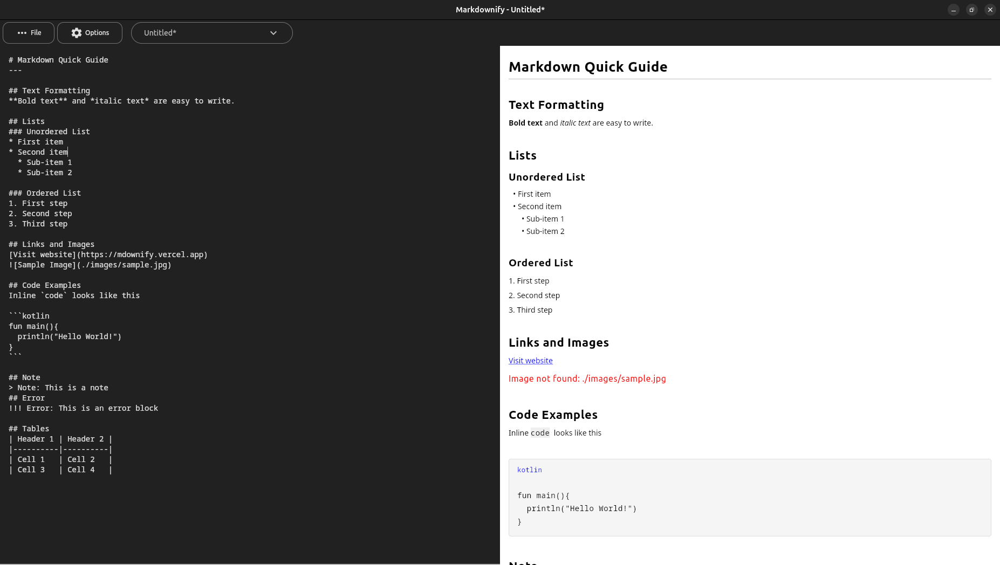

# Markdownify

A desktop markdown editor with live preview, built with Compose for Desktop.


[](https://kotlinlang.org)
[](https://www.jetbrains.com/lp/compose-multiplatform/)



## 🚀 Installation

### Linux Installation (Recommended)

**Easy installation via APT repository:**

📦 **[Install from my APT Repository](https://github.com/zahid4kh/my-apt-repo)**

This is the recommended method for Ubuntu/Debian users as it provides automatic updates and dependency management.

### Download Releases

1. Go to [Releases](https://github.com/zahid4kh/markdownify/releases)
2. Download the appropriate installer:

- **Windows**: `.exe` or `.msi` installer
- **Linux**: `.deb` package (manual installation)

### Manual Linux Installation

```bash
sudo dpkg -i markdownify_1.0.0-1_amd64-wm.deb

sudo apt install -f
```

### Windows Installation

- Run the `.exe` installer and follow the setup wizard
- Administrator privileges may be required

## 🔧 Build from Source

### Prerequisites

- **JDK 17+**
- **Gradle 8.0+**

### Build Steps

```bash
# Clone the repository
git clone https://github.com/zahid4kh/markdownify.git
cd markdownify

# Run the application
./gradlew :run

# Or run with hot-reload for development
./gradlew :runHot --mainClass markdownrenderer --auto

# Create distribution packages
./gradlew packageDeb          # Linux .deb
./gradlew packageMsi          # Windows .msi
./gradlew packageExe          # Windows .exe
./gradlew packageDmg          # macOS .dmg
```

## ✨ Features

### Core Functionality
- **Live Preview** - See your markdown rendered in real-time as you type
- **Split-Pane Interface** - Markdown editor on the left, preview on the right
- **Multiple File Tabs** - Work with multiple markdown files simultaneously
- **Auto-completion** - Smart completion for markdown syntax (backticks, bullet points, indentation)

### Markdown Support
- **Standard Markdown** - Headers, paragraphs, lists, code blocks, links, images
- **Extended Syntax** - Tables, horizontal rules, inline code
- **Custom Banners** - Info, warning, error, success, and note banners (`!!! warning`, `!!! error`, etc.)
- **Clickable Images** - Support for linked images (`[](link)`)
- **Web & Local Images** - Display images from URLs or local file paths

### User Experience
- **Dark/Light Theme** - Toggle between themes with persistent settings
- **File Operations** - Create, open, save markdown files with native file dialogs
- **Clickable Links** - Click links in preview to open in browser with hover tooltips
- **Cross-Platform** - Native installers for Windows (.msi/.exe) and Linux (.deb)

## 🎯 Usage

### Basic Editing
1. **Create/Open Files** - Use the File menu to create new files or open existing ones
2. **Write Markdown** - Type in the left pane, see live preview on the right
3. **Multiple Files** - Use the tab dropdown to switch between open files
4. **Auto-completion** - Type ``` for code blocks, - for bullet points

### Supported Markdown Syntax

#### Standard Elements
```markdown
# Heading 1
## Heading 2
### Heading 3

**Bold text** and *italic text*
`inline code`

- Bullet point
  - Nested bullet

[Link text](https://example.com)

```

## 🏗️ Architecture

### Technology Stack
- **Kotlin** - Primary programming language
- **Compose for Desktop** - UI toolkit
- **Material 3** - Design system with theming
- **Koin** - Dependency injection
- **Kotlinx Serialization** - Settings persistence
- **Coil** - Image loading library

## ⚙️ Configuration

App settings are automatically saved to:
- **Windows**: `%USERPROFILE%\.markdownrenderer\settings.json`
- **macOS**: `~/.markdownrenderer/settings.json`
- **Linux**: `~/.markdownrenderer/settings.json`


## 📝 License

This project is licensed under the MIT License - see the [LICENSE](LICENSE) file for details.

## 🙏 Acknowledgments

- Built with [Compose for Desktop](https://www.jetbrains.com/help/kotlin-multiplatform-dev/compose-multiplatform.html)
- Dialog components from [Deskit](https://github.com/zahid4kh/deskit)
- Generated with [Compose for Desktop Wizard](https://composefordesktop.vercel.app)

---

**Made with ❤️ using Kotlin and Compose for Desktop**